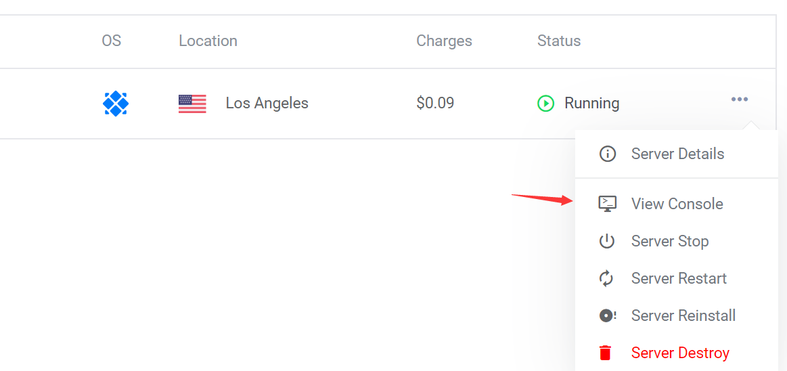

# ladder_build
+ 参考链接：https://www.itwordsweb.com/linux_doc/ss.html
+ 首先买一台vps下面是链接
```
    https://www.vultr.com/?ref=8305002
```
+ 在平台注册账号
```
    注册时成功后可能因为前端做了保活处理之前登陆失败后面可能会出现username valid不用管它再输入一遍用户名密码即可
```
+ 一顿操作见images顺序播放打开终端
    
    
    
    
    
    
    
    
    
+ 服务器配置
    + 输入vps的用户名和密码登陆后依次输入以下命令
        ```
            cd /usr/local/src

            wget --no-check-certificate -O shadowsocks.sh https://raw.githubusercontent.com/teddysun/shadowsocks_install/master/shadowsocks.sh

            chmod +x shadowsocks.sh

            systemctl stop firewalld && systemctl disable firewalld

            ./shadowsocks.sh 2>&1 | tee shadowsocks.log
        ```
    + 见images
        
        

+ windows客户端配置
    + 下载ss（shadowsocks）
        ```
            https://github.com/shadowsocks/shadowsocks-windows/releases
            这边windows直接下载zip包就可以了
        ```
    + 下载完成之后打开windows防火墙允许ss通过，顺便右击ss把该给的权限给了

    + 打开ss
        根据image11的信息做好配置,之后确定
        
    
    + 看见小飞机之后选择系统代理pac模式就可以了
        

    + 其他常用命令
        ```
            启动：/etc/init.d/shadowsocks start
            停止：/etc/init.d/shadowsocks stop
            重启：/etc/init.d/shadowsocks restart
            状态：/etc/init.d/shadowsocks status
            配置文件路径：/etc/shadowsocks.json
            卸载方法：/usr/local/src/shadowsocks.sh uninstall
        ```
    + 多端口开放
        ```
            vi /etc/shadowsock.json

            {
                "server":"my_server_ip",  #填入你的IP地址
                "local_address": "127.0.0.1",
                "local_port":1080,
                "port_password": {
                    "8381": "foobar1",    #端口号，密码
                    "8382": "foobar2",
                    "8383": "foobar3",
                    "8384": "foobar4"
                },
                "timeout":300,
                "method":"aes-256-cfb",
                "fast_open": false
            }

            /etc/init.d/shadowsock restart
        ```
+ 加速服务配置
    + 先确认当前目录
        ```
            wget "https://github.com/chiakge/Linux-NetSpeed/raw/master/tcp.sh" && chmod +x tcp.sh && ./tcp.sh
        ```
    + tcp.sh运行后第一次选2升级内核
        
    
    + 升级后系统自动重启切换到tcp.sh存在的目录继续./tcp.sh 这次选择10

    + 系统自动重启后选择7，稳了
         
+ 安卓客户端配置
    + 下载app
        ```
            https://github.com/shadowsocks/shadowsocks-android/releases
        ```
    + 选择手动配置
        ```
            和windows填入一样的字段（服务器地址，端口号，密码，需要额外确认加密方式是否一致）

            方式选择绕过局域网及中国大陆地址就可以了
        ```

